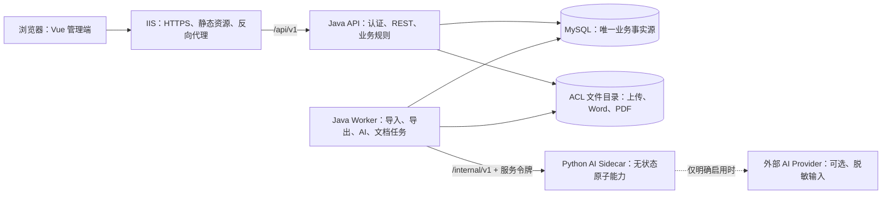
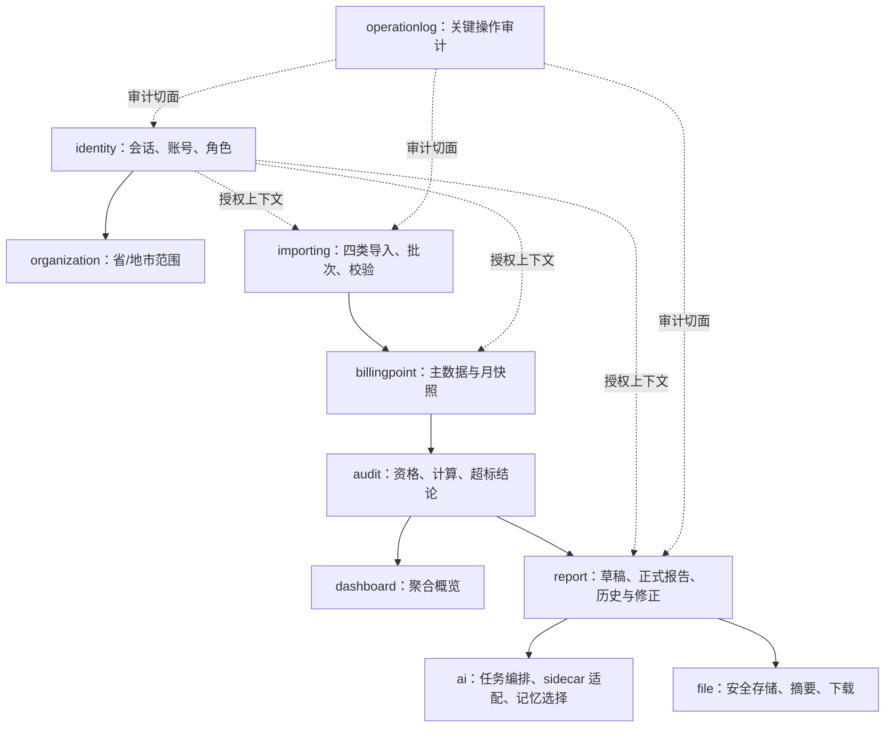
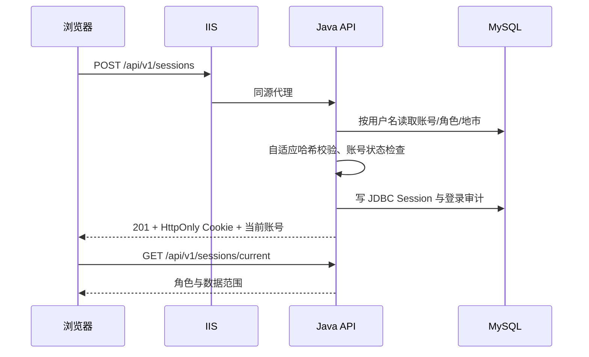
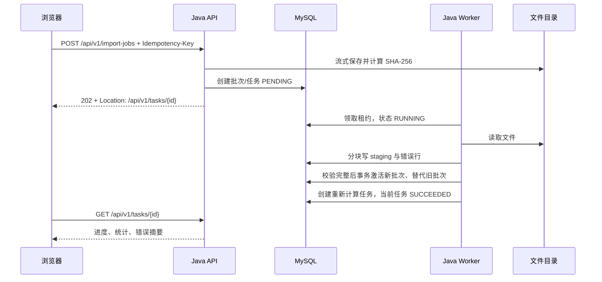
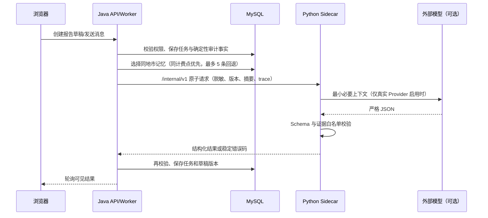

# 系统架构

## 1. 组件边界

公开网络只到 IIS。MySQL、文件目录和 AI sidecar 不对浏览器开放。Python 不访问 MySQL；Java 负责授权、业务状态、重试和审计。

## 2. 后端模块

模块依赖必须指向对方公开的 application API，不得跨模块直接调用 Mapper 或操作表对象。

## 3. 登录流

认证失败不暴露账号是否存在。除安全方法外的浏览器请求必须经过 CSRF 校验。

## 4. 导入与激活流

解析失败或字段错误不会产生半激活批次；旧批次保留以便审计。

## 5. AI 报告流

确定性数值由 Java 计算，AI 不得覆盖。问答不创建草稿版本；编辑、图片分析和历史恢复才创建版本。只有人工确认的修正/最终结论进入后续记忆。

## 6. 部署进程

| 服务 | 入口 | 职责 | 公开性 |
|---|---|---|---|
| IIS Site | `443` | HTTPS、SPA、压缩、缓存、`/api` 反代 | 公开 |
| `three-fees-api` | 回环 Java 端口 | REST 与认证 | 仅 IIS |
| `three-fees-worker` | 无公开端口 | 持久任务消费 | 不公开 |
| MySQL | `3306` | 业务数据库 | 仅受控主机/网段 |

首期为单机可试运行部署。Redis、外部 MQ、对象存储、微服务和 Kubernetes 均不是当前依赖。
